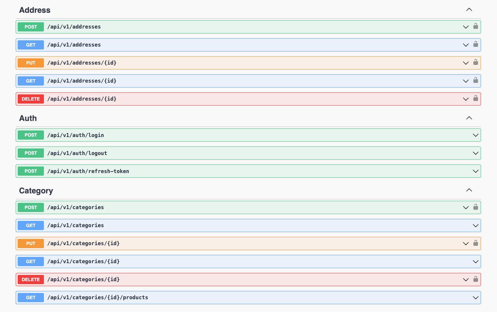

# Fullstack Ecommerce Project

This repository contains the backend server for a fullstack ecommerce project built with ASP.NET Core 8, Entity Framework Core, and PostgreSQL. The frontend of the project, developed with React, Redux Toolkit, TypeScript, Tailwind CSS, and SASS, is maintained in a separate repository and integrates with this backend to provide a seamless user experience and robust management system for administrators.



## Table of Contents

- [Overview](#instruction)
- [Technologies](#technologies)
- [Architecture and Degisn](#architecture-and-design)
   - [CLEAN Architecture](#clean)
   - [Folder Structure](#project-folder-structure)
- [Features](#features)
  - [Mandatory Features](#mandatory-features)
  - [Extra Features](#extra-features)
- [Getting Started](#getting-started)
- [Usage](#usage)
- [Testing](#testing)
- [License](#license)
- [Contact Information](#contact-information)

## Overview

This repository is dedicated to the backend server. The frontend server is hosted in a separate repository. The frontend project must be connected to this backend server to complete the fullstack application.

- **Frontend Repository**: [Frontend Repository Link](https://github.com/actuallyyun/frontend-project)

- **Frontend Live**: [Frontend Live](https://fs17-frontend-project-mauve.vercel.app/)

## Technologies


## Architecture And Design

### CLEAN 

This project follows the principles of Clean Architecture, emphasizing separation of concerns and modularity. It is organized into several layers, each with distinct responsibilities.

1. Core Domain Layer (Ecommerce.Core)
- Centralizes core domain logic and entities.
- Includes common functionalities, repository abstractions, and value objects.
2. Application Service Layer (Ecommerce.Service)
- Implements business logic and orchestrates interactions between controllers and the core domain.
- Services handle DTO transformations and business operations related to each resource.
3. Controller Layer (Ecommerce.Controller)
- Contains controllers responsible for handling HTTP requests and responses.
- Controllers are organised by resource types (e.g., Auth, Category, Order, Product, Review, User).
4. Infrastructure Layer (Ecommerce.WebAPI)
- Manages infrastructure tasks and interaction with external systems.
- Contains database context, repositories, and middleware for error handling.
5. Testing Layer (Ecommerce.Test)
- Holds unit tests for core domain and application services.
- Ensures the reliability and correctness of the implemented functionalities.


### Project folder structure

```
├── Ecommerce.Controller
│   ├── Ecommerce.Controller.csproj
│   └── src
│       ├── Controller
│       │   ├── AddressController.cs
│       │   ├── AuthController.cs
│       │   ├── CategoryController.cs
│       │   ├── ImageController.cs
│       │   ├── OrderController.cs
│       │   ├── ProductController.cs
│       │   ├── ReviewController.cs
│       │   └── UserController.cs
│       └── DataModel
│           └── FormDataModel.cs
├── Ecommerce.Core
│   ├── Ecommerce.Core.csproj
│   └── src
│       ├── Common
│       │   ├── AppConstants.cs
│       │   ├── AppException.cs
│       │   ├── LINQParams.cs
│       │   ├── QueryOptions.cs
│       │   └── UserCredential.cs
│       ├── Entity
│       │   ├── Address.cs
│       │   ├── BaseEntity.cs
│       │   ├── Category.cs
│       │   ├── Order.cs
│       │   ├── OrderItem.cs
│       │   ├── Product.cs
│       │   ├── ProductImage.cs
│       │   ├── Review.cs
│       │   ├── TimeStamp.cs
│       │   ├── Token.cs
│       │   └── User.cs
│       ├── RepoAbstraction
│       │   ├── IAddressRepository.cs
│       │   ├── ICategoryRepository.cs
│       │   ├── IImageRepository.cs
│       │   ├── IOrderItemRepo.cs
│       │   ├── IOrderRepository.cs
│       │   ├── IProductRepository.cs
│       │   ├── IRefreshTokenRepo.cs
│       │   ├── IReviewRepository.cs
│       │   └── IUserRepository.cs
│       └── ValueObject
│           ├── OrderStatus.cs
│           ├── SortBy.cs
│           ├── SortOrder.cs
│           ├── TokenType.cs
│           └── UserRole.cs
├── Ecommerce.Service
│   ├── Ecommerce.Service.csproj
│   ├── Ecommerce.Service.sln
│   └── src
│       ├── DTO
│       │   ├── AddressDto.cs
│       │   ├── CategoryDTO.cs
│       │   ├── ImageDto.cs
│       │   ├── OrderDTO.cs
│       │   ├── ProductDto.cs
│       │   ├── ReviewDto.cs
│       │   ├── TokenDto.cs
│       │   └── UserDto.cs
│       ├── MappingProfile.cs
│       ├── Service
│       │   ├── AddressService.cs
│       │   ├── AuthService.cs
│       │   ├── CategoryService.cs
│       │   ├── ImageService.cs
│       │   ├── OrderService.cs
│       │   ├── ProductService.cs
│       │   ├── ReviewService.cs
│       │   └── UserService.cs
│       ├── ServiceAbstraction
│       │   ├── IAddressService.cs
│       │   ├── IAuthService.cs
│       │   ├── ICategoryService.cs
│       │   ├── IOrderService.cs
│       │   ├── IPasswordService.cs
│       │   ├── IProductImageService.cs
│       │   ├── IProductService.cs
│       │   ├── IReviewService.cs
│       │   ├── ITokenService.cs
│       │   └── IUserService.cs
│       └── Validation
│           ├── CustomValidator.cs
│           └── UserValidation.cs
├── Ecommerce.Tests
│   ├── Ecommerce.Tests.csproj
│   ├── Ecommerce.Tests.sln
│   └── src
│       ├── Core
│       │   ├── AddressTests.cs
│       │   ├── CategoryTest.cs
│       │   └── UserTest.cs
│       └── Service
│           ├── AuthServiceTests.cs
│           ├── CategoryServiceTest.cs
│           ├── OrderServiceTests.cs
│           ├── ProductService
│           │   └── ProductServiceTests.cs
│           ├── ReviewServiceTest.cs
│           ├── TestUtils.cs
│           ├── TokenServiceTests.cs
│           └── UserServiceTests.cs
├── Ecommerce.WebApi
│   ├── Ecommerce.WebApi.csproj
│   ├── Ecommerce.WebApi.http
│   ├── Ecommerce.WebApi.sln
│   ├── Program.cs
│   ├── appsettings.json
│   └── src
│       ├── Authorization
│       │   └── AdminOrAddressOwnerHandler.cs
│       ├── Database
│       │   ├── EcommerceDbContext.cs
│       │   ├── Interceptors
│       │   │   ├── SqlLoggingInterceptor.cs
│       │   │   └── TimeStampInterceptor.cs
│       │   └── SeedData.cs
│       ├── Middleware
│       │   ├── ExceptionHandlerMiddleware.cs
│       │   └── VerifySourceOwner.cs
│       ├── Repo
│       │   ├── AddressRepo.cs
│       │   ├── CategoryRepo.cs
│       │   ├── ImageRepo.cs
│       │   ├── OrderItemRepo.cs
│       │   ├── OrderRepo.cs
│       │   ├── ProductRepo.cs
│       │   ├── RefreshTokenRepo.cs
│       │   ├── ReviewRepo.cs
│       │   └── UserRepo.cs
│       └── Service
│           ├── PasswordService.cs
│           └── TokenService.cs
├── Ecommerce.sln
├── README.md
```

## Features

### User Functionalities

- **User Management**: Users can register for an account and manage their profile.
- **Browse Products**: Users can view all available products, single products, search, and sort products.
- **Add to Cart**: Users can add products to a shopping cart and manage the cart.
- **Orders**: Users can place orders and view their order history.
- **Reviews**: Users can write,update and delete reviews for products.
- **Addresses**:User can create, update, and delete their addresses.

### Admin Functionalities

- **User Management**: Admins can manage all users.
- **Product Management**: Admins can manage all products.
- **Order Management**: Admins can manage all orders.

### Extra Features

- **Third-Party Integrations**: Google Authentication

- **Advanced Functionalities**: user can sort, filter and search products.

## Getting Started

### Prerequisites

You should have the following tools in your local machine:

- git
- an code editor, we use VS Code
- C# Dev kit for VS Code


### Installation

1. **Clone the repository:**

   ```bash
   git clone https://github.com/actuallyyun/cat-ecommerce-api
   ```
2. **Set up the `appsettings.json` file:**

   The `appsettings.json` file contains sensitive information and is not included in the repository. Create this file in the `Ecommerce.WebApi` project directory with the following content:

   ```json
   {
     “Logging”: {
       “LogLevel”: {
         “Default”: “Information”,
         “Microsoft.AspNetCore”: “Warning”
       }
     },
     “AllowedHosts”: “*”,
     “ConnectionStrings”: {
       “Localhost”: “Host=localhost;Username=yourusername;Password=yourpassword;Database=yourdatabase”,
       “Remote”: “Host=remotehost;Username=remoteusername;Password=remotepassword;Database=remotedatabase;SslMode=Require”
     },
     “Secrets”: {
       “JwtKey”: “your_jwt_key”,
       “Issuer”: “your_issuer”
     }
   }
   ```

   Replace the placeholder values (`yourusername`, `yourpassword`, `yourdatabase`, `remotehost`, `remoteusername`, `remotepassword`, `remotedatabase`, `your_jwt_key`, `your_issuer`) with your actual database and secret information.


3. **Initiate database:** 

 `dotnet ef migrations add CreateDb` 
 
 You can name this migration anything you like. But the convention is `CreateDb` or `InitDb` for initial setup.

4. **Push the changes to  database:**  

`dotnet ef database update`.

> Note: If you have changes in the code that cause conflicts in the database tables, you will have to drop databse: `dotnet ef database drop`.

It requires `superuser` role, to grant it, you can run `alter user test_admin with superuser;` in `psql` command line.

In future, everytime you change database design in the code, you have to run the commands:  

   `dotnet ef migrations add MyNewChange`

   `dotnet ef database update`

### Start the server

If you are in root directory, use the following command:

`dotnet watch --project Ecommerce.WebApi`
 
If you are in `WebApi` directory, you can run `dotnet watch run`.

The above commands run the project in `watch` mode that supports sweet features like hot reload. 

The app should be running in localhost.

## Usage

To use the APIs provided by the Ecommerce API , refer to the detailed API documentation available at the Swagger UI:
[Swagger API Documentation](https://catagonia.azurewebsites.net/index.html)

### Example API Endpoints

- **Authentication**
  - `POST /api/auth/login`: User login
  - `POST /api/auth/register`: User registration
- **Products**
  - `GET /api/products`: Retrieve all products
  - `POST /api/products`: Create a new product
  - `GET /api/products/{id}`: Retrieve a product by ID
  - `PUT /api/products/{id}`: Update a product by ID
  - `DELETE /api/products/{id}`: Delete a product by ID
- **Categories**
  - `GET /api/categories`: Retrieve all categories
  - `POST /api/categories`: Create a new category
  - `GET /api/categories/{id}`: Retrieve a category by ID
  - `PUT /api/categories/{id}`: Update a category by ID
  - `DELETE /api/categories/{id}`: Delete a category by ID
- **Orders**
  - `GET /api/orders`: Retrieve all orders
  - `POST /api/orders`: Create a new order
  - `GET /api/orders/{id}`: Retrieve an order by ID
  - `PUT /api/orders/{id}`: Update an order by ID
  - `DELETE /api/orders/{id}`: Delete an order by ID
- **Reviews**
  - `GET /api/reviews`: Retrieve all reviews
  - `POST /api/reviews`: Create a new review
  - `GET /api/reviews/{id}`: Retrieve a review by ID
  - `PUT /api/reviews/{id}`: Update a review by ID
  - `DELETE /api/reviews/{id}`: Delete a review by ID
- **Users**
  - `GET /api/users`: Retrieve all users
  - `GET /api/users/{id}`: Retrieve a user by ID
  - `PUT /api/users/{id}`: Update a user by ID
  - `DELETE /api/users/{id}`: Delete a user by ID

## Testing

The projects implment unit testing for `Core` and `Service` layers.

Testing technologies used are:

- xunit
- Moq 

To run tests: `dotnet test`


## License
This project is licensed under the MIT License. 

## Contact Information
For any questions, issues, or suggestions, please contact:
- **Project Maintainer**: [Yun](mailto:this.jiyun@gmail.com)
---
